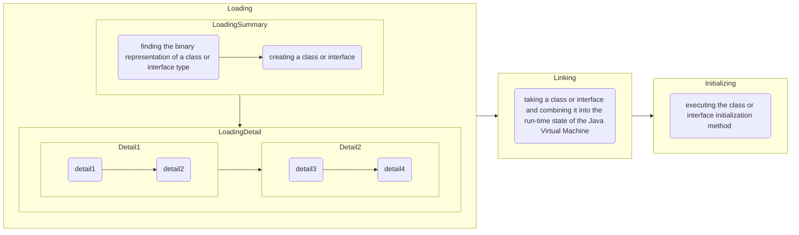

# Loading, Linking, and Initializing

``` mermaid
flowchart LR
  subgraph Loading
    direction TB
    subgraph LoadingSummary
        direction LR
        loading1(finding the binary representation of a class or interface type)
        loading2(creating a class or interface)
    end
    subgraph LoadingDetail
      direction LR
      subgraph Detail1
        direction LR
        ldetail1(detail1)
        ldetail2(detail2)
      end
      subgraph Detail2
        direction LR
        ldetail3(detail3)
        ldetail4(detail4)
      end
    end
    
  end
  subgraph Linking
        direction LR
        lingking1(taking a class or interface and combining it into the run-time state of the Java Virtual Machine)
  end
  subgraph Initializing
        direction LR
        initializing1(executing the class or interface initialization method <clinit> )
  end
  Loading --> Linking --> Initializing
  LoadingSummary --> LoadingDetail
  ldetail1 --> ldetail2
  ldetail3 --> ldetail4
  loading1 --> loading2
  Detail1 --> Detail2

```

# all compilers and the corelation
1. llvm
2. gcc
3. how a process is loaded and executed in linux
