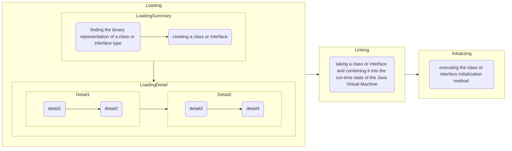

# Loading, Linking, and Initializing

1. 加载
将class文件读入jvm
2. 验证
确保类结构合法
3. 准备
给静态字段分配默认初始值
4. 解析
将符号引用转化为直接饮用
5. 初始化
执行静态初始化块和静态变量赋值
## 什么会触发类的初始化
1. 创建类的实例：new
2. 访问类的静态字段（非final）
3. 调用类的静态方法
4. 通过反射调用构造方法
5. 使用Class.forName(name)

## 什么时候只会加载而不初始化
1. 使用Class.forName(name,false,cl)并设置不初始化
2. 应用final static编译期常量

# all compilers and the corelation
1. llvm
2. gcc
3. how a process is loaded and executed in linux
